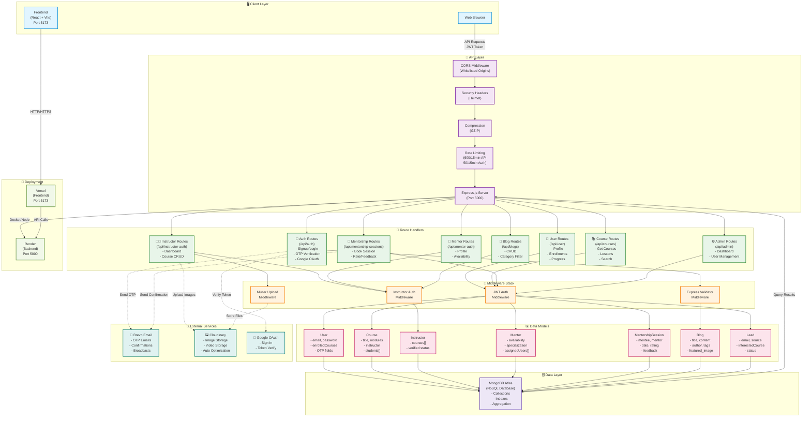
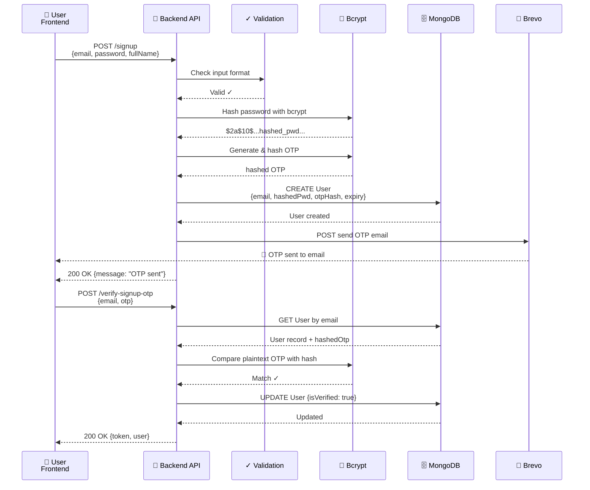
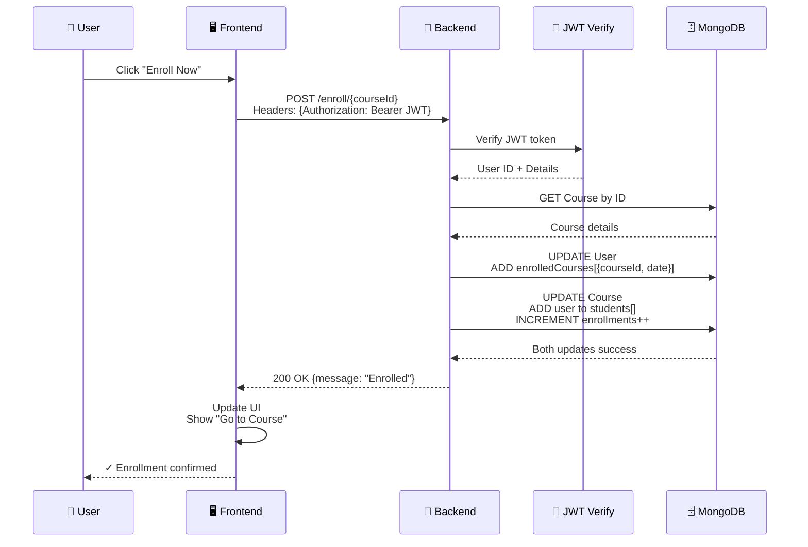
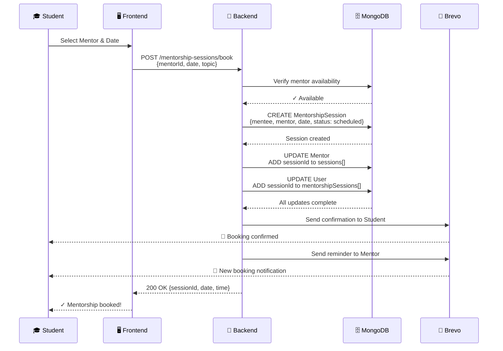
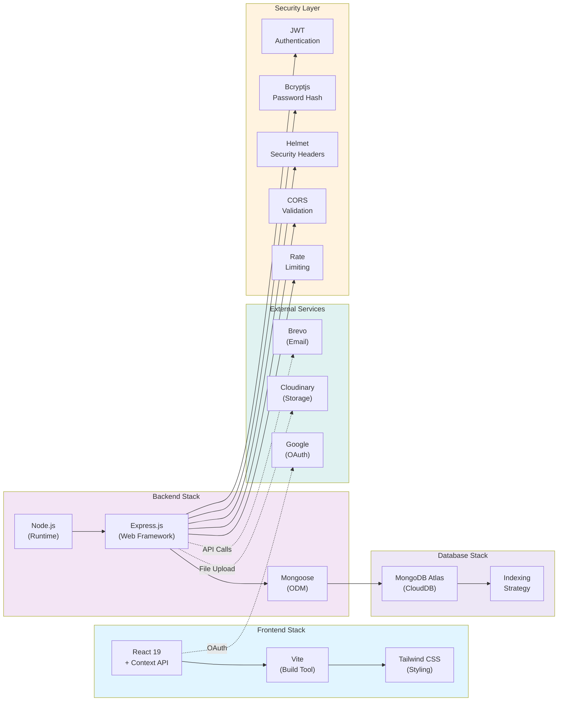
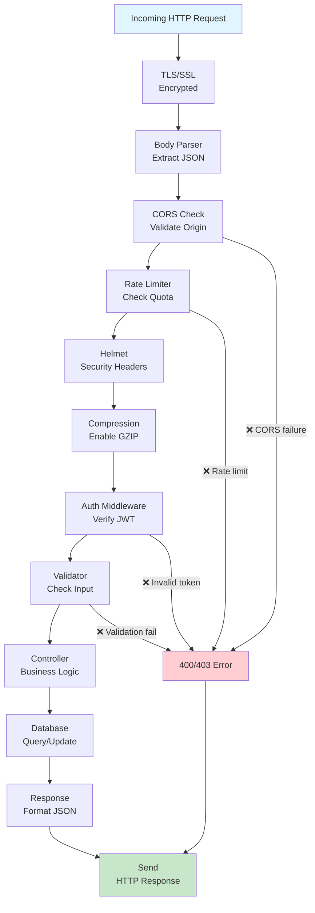

# YuganthaAI - Backend Architecture Diagram

## System Architecture Overview



## Data Flow Diagram - User Signup



## Data Flow Diagram - Course Enrollment



## Data Flow Diagram - Mentorship Booking



## Technology Stack Layer



## Authentication State Machine

```mermaid
stateDiagram-v2
    [*] --> Unauthenticated

    Unauthenticated --> Signup: User submits signup
    Signup --> OTPWaiting: OTP sent to email
    OTPWaiting --> EmailVerified: OTP correct
    EmailVerified --> Authenticated: JWT issued
    
    Unauthenticated --> Login: User submits credentials
    Login --> Authenticated: Password matches + JWT issued

    Unauthenticated --> GoogleOAuth: Click "Sign in with Google"
    GoogleOAuth --> Authenticated: Google token verified + JWT issued

    Authenticated --> PasswordReset: User clicks "Forgot Password"
    PasswordReset --> ResetOTPWaiting: Reset OTP sent
    ResetOTPWaiting --> ResetVerified: Reset OTP correct
    ResetVerified --> Authenticated: New password set

    Authenticated --> Logout: User logs out
    Logout --> Unauthenticated: Token cleared

    Authenticated --> TokenExpired: 30 days pass
    TokenExpired --> Unauthenticated: Token invalid

    Authenticated --> Instructor: Switch to instructor role
    Instructor --> InstructorAuth: Instructor dashboard
    
    Authenticated --> Mentor: Switch to mentor role
    Mentor --> MentorAuth: Mentor dashboard

    note right of Authenticated
        JWT Token Valid
        User Data in Context
        localStorage persists token
    end

    note right of Unauthenticated
        No JWT Token
        No User State
        Redirect to login
    end
```

## Request Processing Pipeline


