# 🏗️ Yuganta-AI — LMS & Cloud Storage Architecture

> Complete architectural documentation for the **Yuganta-AI Learning Management System** and its **Cloud Storage** infrastructure.

---

## 1. High-Level System Architecture

Full-stack overview showing Client → Vite/React Frontend → Express.js Backend → MongoDB, Cloudflare R2, Cloudinary, and Brevo.

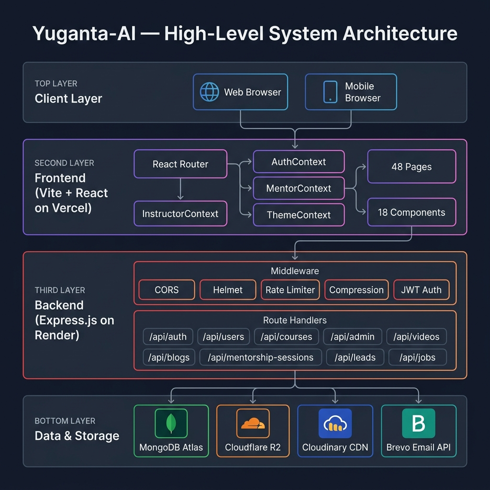

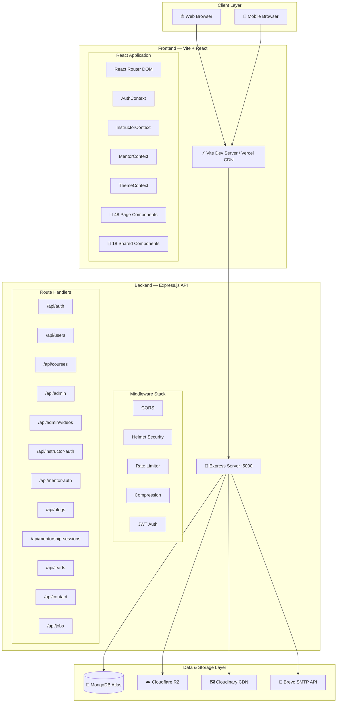
```mermaid
graph TB
    subgraph "Client Layer"
        Browser["🌐 Web Browser"]
        Mobile["📱 Mobile Browser"]
    end

    subgraph "Frontend — Vite + React"
        direction TB
        ViteApp["⚡ Vite Dev Server / Vercel CDN"]
        subgraph "React Application"
            Router["React Router DOM"]
            AuthCtx["AuthContext"]
            InstrCtx["InstructorContext"]
            MentorCtx["MentorContext"]
            ThemeCtx["ThemeContext"]
            Pages["📄 48 Page Components"]
            Components["🧩 18 Shared Components"]
        end
    end

    subgraph "Backend — Express.js API"
        direction TB
        Express["🚀 Express Server :5000"]
        subgraph "Middleware Stack"
            CORS["CORS"]
            Helmet["Helmet Security"]
            RateLimit["Rate Limiter"]
            Compression["Compression"]
            JWT["JWT Auth"]
        end
        subgraph "Route Handlers"
            AuthRoutes["/api/auth"]
            UserRoutes["/api/users"]
            CourseRoutes["/api/courses"]
            AdminRoutes["/api/admin"]
            VideoRoutes["/api/admin/videos"]
            InstrRoutes["/api/instructor-auth"]
            MentorRoutes["/api/mentor-auth"]
            BlogRoutes["/api/blogs"]
            SessionRoutes["/api/mentorship-sessions"]
            LeadRoutes["/api/leads"]
            ContactRoutes["/api/contact"]
            JobRoutes["/api/jobs"]
        end
    end

    subgraph "Data & Storage Layer"
        MongoDB[("🍃 MongoDB Atlas")]
        R2["☁️ Cloudflare R2"]
        Cloudinary["🖼️ Cloudinary CDN"]
        Brevo["📧 Brevo SMTP API"]
    end

    Browser --> ViteApp
    Mobile --> ViteApp
    ViteApp --> Express
    Express --> MongoDB
    Express --> R2
    Express --> Cloudinary
    Express --> Brevo
```

---

## 2. LMS Core Data Flow

Student journey (signup → enroll → watch → progress), Instructor flow, Mentor flow, and Admin operations.

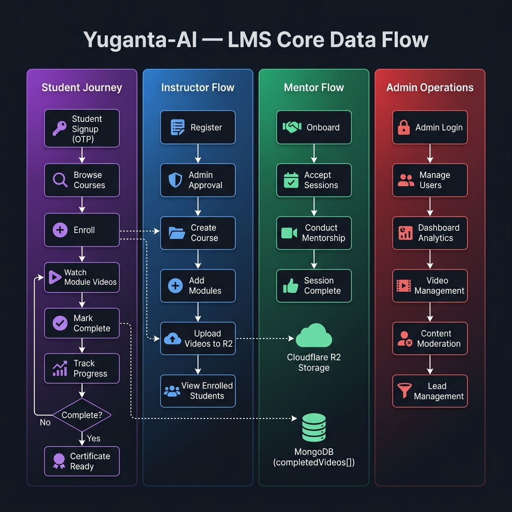

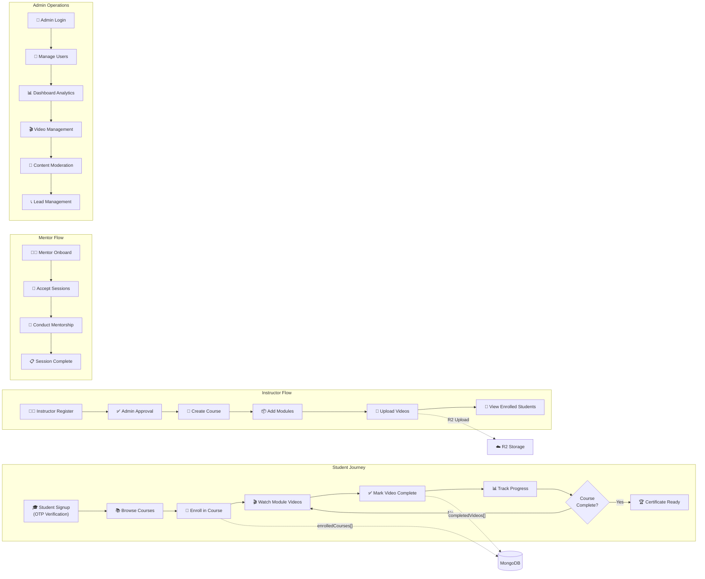
```mermaid
flowchart LR
    subgraph "Student Journey"
        A["🎓 Student Signup<br/>(OTP Verification)"] --> B["📚 Browse Courses"]
        B --> C["📝 Enroll in Course"]
        C --> D["🎬 Watch Module Videos"]
        D --> E["✅ Mark Video Complete"]
        E --> F["📊 Track Progress"]
        F --> G{"Course<br/>Complete?"}
        G -->|No| D
        G -->|Yes| H["🏆 Certificate Ready"]
    end

    subgraph "Instructor Flow"
        I["👩‍🏫 Instructor Register"] --> J["✅ Admin Approval"]
        J --> K["📖 Create Course"]
        K --> L["📦 Add Modules"]
        L --> M["🎥 Upload Videos"]
        M --> N["👥 View Enrolled Students"]
    end

    subgraph "Mentor Flow"
        O["🧑‍🏫 Mentor Onboard"] --> P["📅 Accept Sessions"]
        P --> Q["🎯 Conduct Mentorship"]
        Q --> R["📋 Session Complete"]
    end

    subgraph "Admin Operations"
        S["🔐 Admin Login"] --> T["👤 Manage Users"]
        T --> U["📊 Dashboard Analytics"]
        U --> V["🎬 Video Management"]
        V --> W["📝 Content Moderation"]
        W --> X["📞 Lead Management"]
    end

    C -.->|"enrolledCourses[]"| MongoDB2[("MongoDB")]
    M -.->|"R2 Upload"| R2_2["☁️ R2 Storage"]
    E -.->|"completedVideos[]"| MongoDB2
```

---

## 3. Cloud Storage Architecture

Dual-provider pipeline — Cloudflare R2 for video storage, Cloudinary for images and documents.

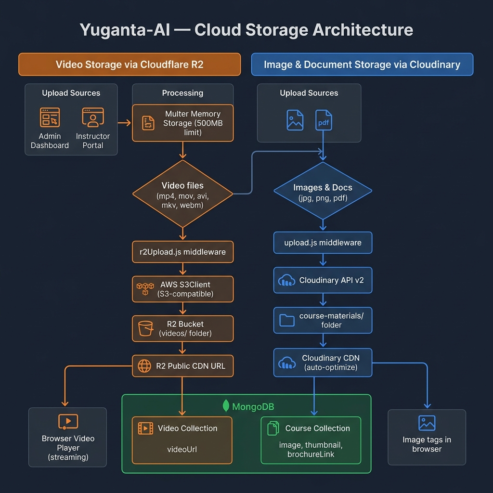

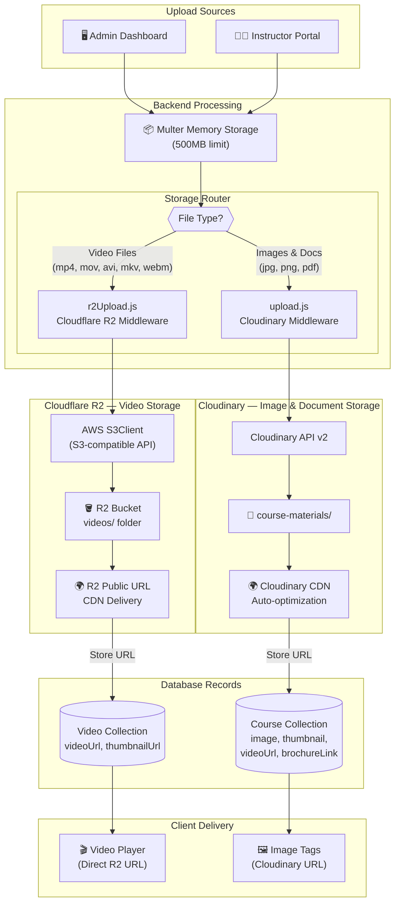
```mermaid
flowchart TB
    subgraph "Upload Sources"
        AdminUI["🖥️ Admin Dashboard"]
        InstrUI["👩‍🏫 Instructor Portal"]
    end

    subgraph "Backend Processing"
        direction TB
        Multer["📦 Multer Memory Storage<br/>(500MB limit)"]
        
        subgraph "Storage Router"
            Decision{{"File Type?"}}
            R2MW["r2Upload.js<br/>Cloudflare R2 Middleware"]
            CloudMW["upload.js<br/>Cloudinary Middleware"]
        end
    end

    subgraph "Cloudflare R2 — Video Storage"
        direction TB
        S3Client["AWS S3Client<br/>(S3-compatible API)"]
        R2Bucket["🪣 R2 Bucket<br/>videos/ folder"]
        R2CDN["🌍 R2 Public URL<br/>CDN Delivery"]
    end

    subgraph "Cloudinary — Image & Document Storage"
        direction TB
        CloudAPI["Cloudinary API v2"]
        CloudFolder["📁 course-materials/"]
        CloudCDN["🌍 Cloudinary CDN<br/>Auto-optimization"]
    end

    subgraph "Database Records"
        VideoDB[("Video Collection<br/>videoUrl, thumbnailUrl")]
        CourseDB[("Course Collection<br/>image, thumbnail,<br/>videoUrl, brochureLink")]
    end

    subgraph "Client Delivery"
        Player["🎬 Video Player<br/>(Direct R2 URL)"]
        ImgTag["🖼️ Image Tags<br/>(Cloudinary URL)"]
    end

    AdminUI --> Multer
    InstrUI --> Multer
    Multer --> Decision
    Decision -->|"Video Files<br/>(mp4, mov, avi, mkv, webm)"| R2MW
    Decision -->|"Images & Docs<br/>(jpg, png, pdf)"| CloudMW
    
    R2MW --> S3Client
    S3Client --> R2Bucket
    R2Bucket --> R2CDN
    
    CloudMW --> CloudAPI
    CloudAPI --> CloudFolder
    CloudFolder --> CloudCDN

    R2CDN -->|"Store URL"| VideoDB
    CloudCDN -->|"Store URL"| CourseDB

    VideoDB --> Player
    CourseDB --> ImgTag
```

---

## 4. Database Entity-Relationship Diagram

All 10 Mongoose models with fields, relationships, and cardinality.

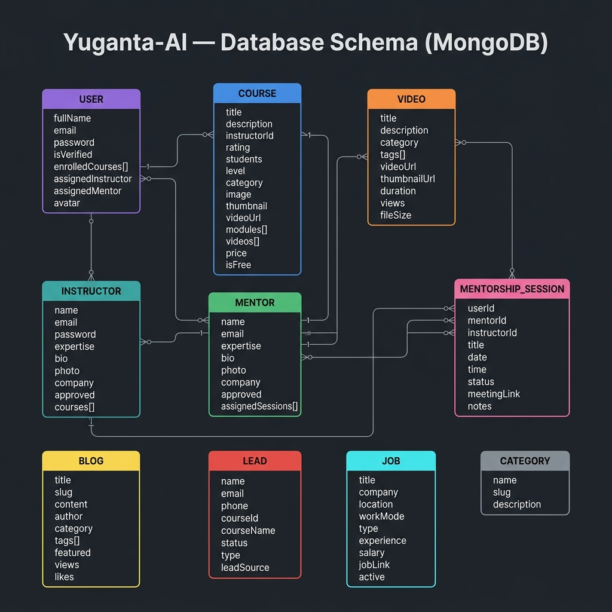

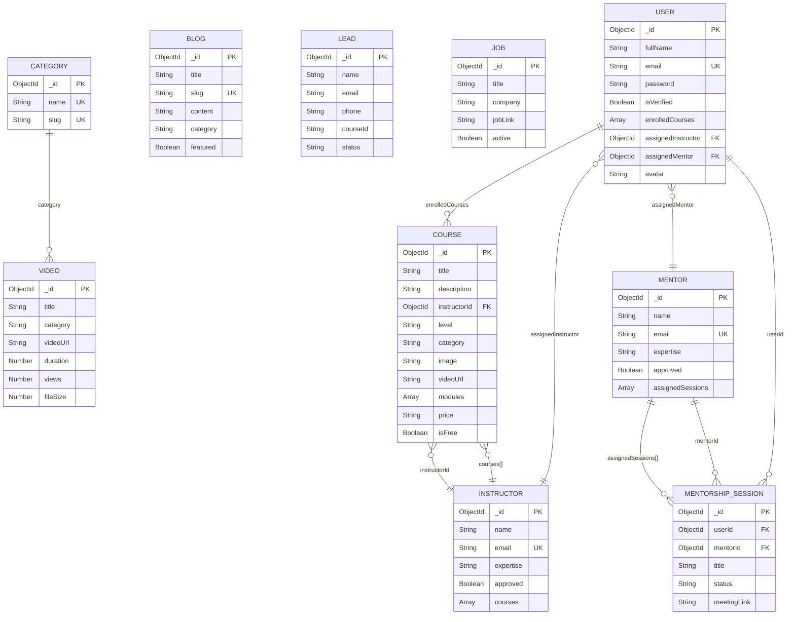
```mermaid
erDiagram
    USER {
        ObjectId _id PK
        String fullName
        String email UK
        String password
        Boolean isVerified
        Array enrolledCourses
        ObjectId assignedInstructor FK
        ObjectId assignedMentor FK
        String avatar
    }
    
    COURSE {
        ObjectId _id PK
        String title
        String description
        ObjectId instructorId FK
        String level
        String category
        String image
        String videoUrl
        Array modules
        String price
        Boolean isFree
    }

    VIDEO {
        ObjectId _id PK
        String title
        String category
        String videoUrl
        Number duration
        Number views
        Number fileSize
    }

    INSTRUCTOR {
        ObjectId _id PK
        String name
        String email UK
        String expertise
        Boolean approved
        Array courses
    }

    MENTOR {
        ObjectId _id PK
        String name
        String email UK
        String expertise
        Boolean approved
        Array assignedSessions
    }

    MENTORSHIP_SESSION {
        ObjectId _id PK
        ObjectId userId FK
        ObjectId mentorId FK
        String title
        String status
        String meetingLink
    }

    BLOG {
        ObjectId _id PK
        String title
        String slug UK
        String content
        String category
        Boolean featured
    }

    LEAD {
        ObjectId _id PK
        String name
        String email
        String phone
        String courseId
        String status
    }

    JOB {
        ObjectId _id PK
        String title
        String company
        String jobLink
        Boolean active
    }

    CATEGORY {
        ObjectId _id PK
        String name UK
        String slug UK
    }

    USER ||--o{ COURSE : "enrolledCourses"
    USER }o--|| INSTRUCTOR : "assignedInstructor"
    USER }o--|| MENTOR : "assignedMentor"
    COURSE }o--|| INSTRUCTOR : "instructorId"
    INSTRUCTOR ||--o{ COURSE : "courses[]"
    MENTOR ||--o{ MENTORSHIP_SESSION : "assignedSessions[]"
    USER ||--o{ MENTORSHIP_SESSION : "userId"
    MENTORSHIP_SESSION }o--|| MENTOR : "mentorId"
    CATEGORY ||--o{ VIDEO : "category"
```

---

## 5. Authentication & Authorization Flow

Multi-role JWT authentication for Student, Admin, Instructor, and Mentor.

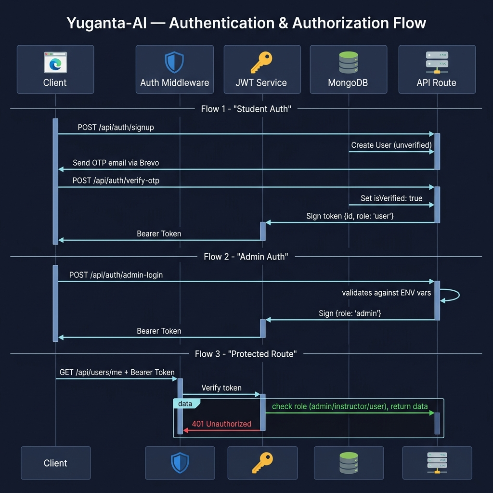

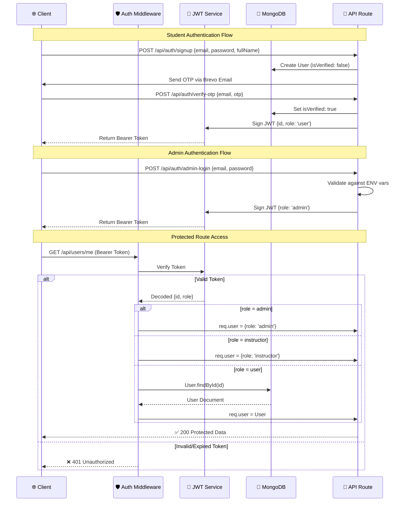
```mermaid
sequenceDiagram
    participant C as 🌐 Client
    participant MW as 🛡️ Auth Middleware
    participant JWT as 🔑 JWT Service
    participant DB as 🍃 MongoDB
    participant API as 🚀 API Route

    Note over C,API: Student Authentication Flow
    C->>API: POST /api/auth/signup {email, password, fullName}
    API->>DB: Create User (isVerified: false)
    API->>C: Send OTP via Brevo Email
    C->>API: POST /api/auth/verify-otp {email, otp}
    API->>DB: Set isVerified: true
    API->>JWT: Sign JWT {id, role: 'user'}
    JWT-->>C: Return Bearer Token

    Note over C,API: Admin Authentication Flow
    C->>API: POST /api/auth/admin-login {email, password}
    API->>API: Validate against ENV vars
    API->>JWT: Sign JWT {role: 'admin'}
    JWT-->>C: Return Bearer Token

    Note over C,API: Protected Route Access
    C->>MW: GET /api/users/me (Bearer Token)
    MW->>JWT: Verify Token
    alt Valid Token
        JWT-->>MW: Decoded {id, role}
        alt role = admin
            MW->>API: req.user = {role: 'admin'}
        else role = instructor
            MW->>API: req.user = {role: 'instructor'}
        else role = user
            MW->>DB: User.findById(id)
            DB-->>MW: User Document
            MW->>API: req.user = User
        end
        API-->>C: ✅ 200 Protected Data
    else Invalid/Expired Token
        MW-->>C: ❌ 401 Unauthorized
    end
```

---

## 6. Mentorship Session Lifecycle

State machine showing booking → assignment → scheduling → completion.

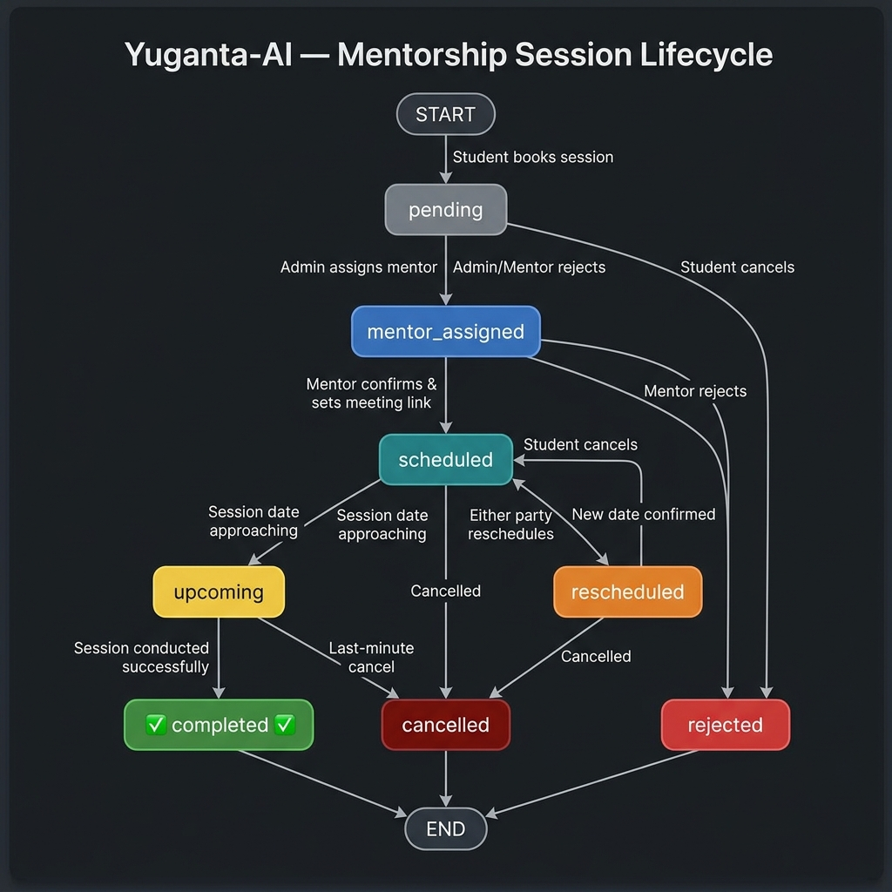

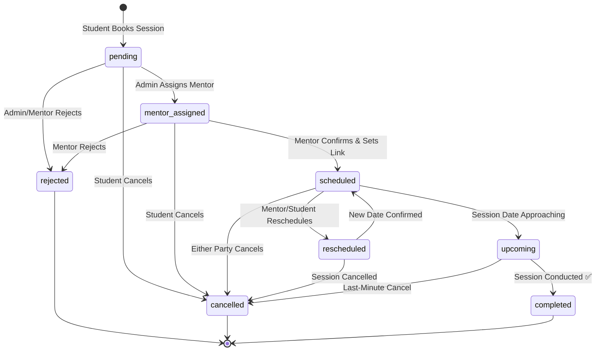
```mermaid
stateDiagram-v2
    [*] --> pending: Student Books Session
    
    pending --> mentor_assigned: Admin Assigns Mentor
    pending --> rejected: Admin/Mentor Rejects
    pending --> cancelled: Student Cancels
    
    mentor_assigned --> scheduled: Mentor Confirms & Sets Link
    mentor_assigned --> rejected: Mentor Rejects
    mentor_assigned --> cancelled: Student Cancels
    
    scheduled --> upcoming: Session Date Approaching
    scheduled --> rescheduled: Mentor/Student Reschedules
    scheduled --> cancelled: Either Party Cancels
    
    rescheduled --> scheduled: New Date Confirmed
    rescheduled --> cancelled: Session Cancelled
    
    upcoming --> completed: Session Conducted ✅
    upcoming --> cancelled: Last-Minute Cancel
    
    rejected --> [*]
    cancelled --> [*]
    completed --> [*]
```

---

## 7. API Route Architecture

Express middleware chain, rate limiters, 12 route groups, and auth guards.

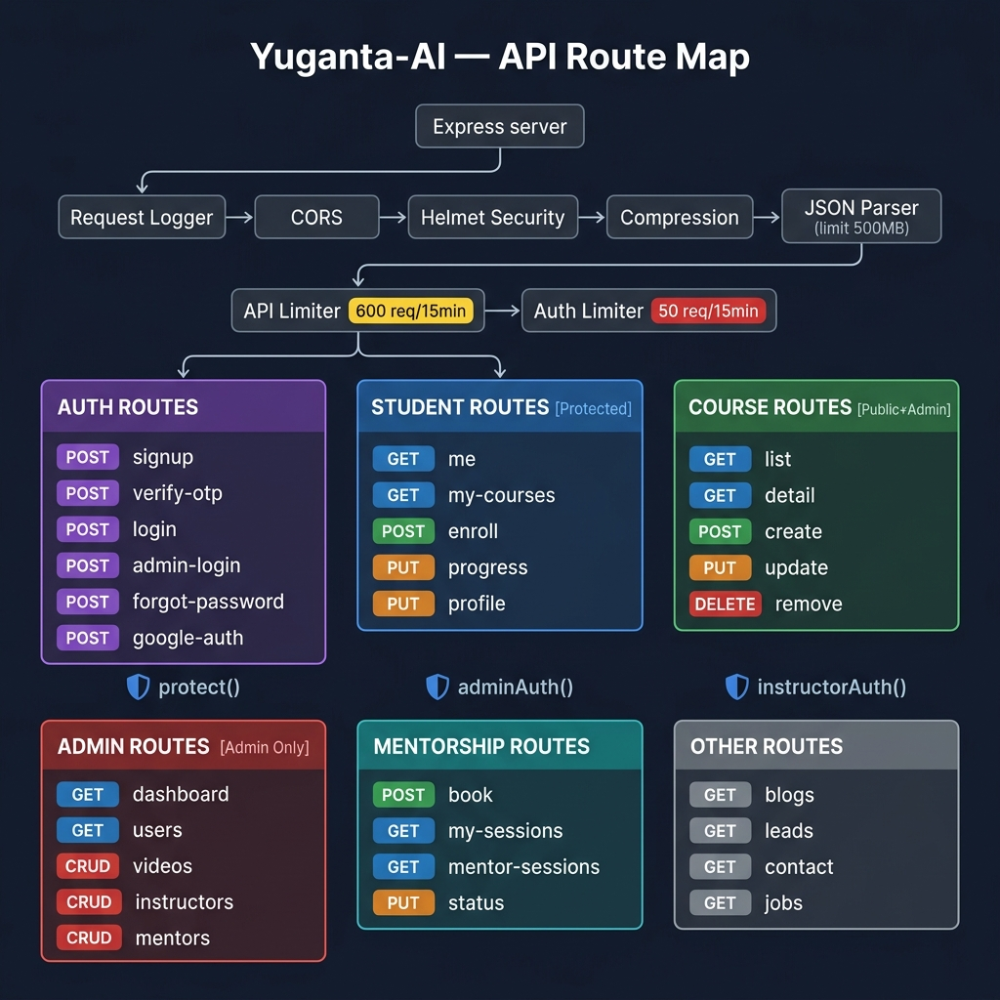

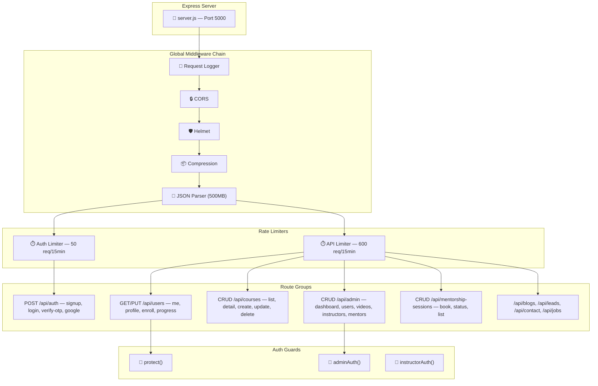
```mermaid
flowchart TB
    subgraph "Express Server"
        Entry["🚀 server.js — Port 5000"]
    end

    subgraph "Global Middleware Chain"
        direction LR
        M1["📡 Request Logger"]
        M2["🔒 CORS"]
        M3["🛡️ Helmet"]
        M4["📦 Compression"]
        M5["📝 JSON Parser (500MB)"]
        M1 --> M2 --> M3 --> M4 --> M5
    end

    subgraph "Rate Limiters"
        APILimit["⏱️ API Limiter — 600 req/15min"]
        AuthLimit["⏱️ Auth Limiter — 50 req/15min"]
    end

    subgraph "Route Groups"
        Auth["POST /api/auth — signup, login, verify-otp, google"]
        Users["GET/PUT /api/users — me, profile, enroll, progress"]
        Courses["CRUD /api/courses — list, detail, create, update, delete"]
        Admin["CRUD /api/admin — dashboard, users, videos, instructors, mentors"]
        Sessions["CRUD /api/mentorship-sessions — book, status, list"]
        Other["/api/blogs, /api/leads, /api/contact, /api/jobs"]
    end

    subgraph "Auth Guards"
        Protect["🔑 protect()"]
        AdminAuth["🔐 adminAuth()"]
        InstrAuth["🔐 instructorAuth()"]
    end

    Entry --> M1
    M5 --> APILimit & AuthLimit
    APILimit --> Courses & Users & Admin & Sessions & Other
    AuthLimit --> Auth
    Users --> Protect
    Admin --> AdminAuth
```

---

## 8. Deployment Architecture

Production infrastructure across Vercel, Render, MongoDB Atlas, Cloudflare R2, and Cloudinary.

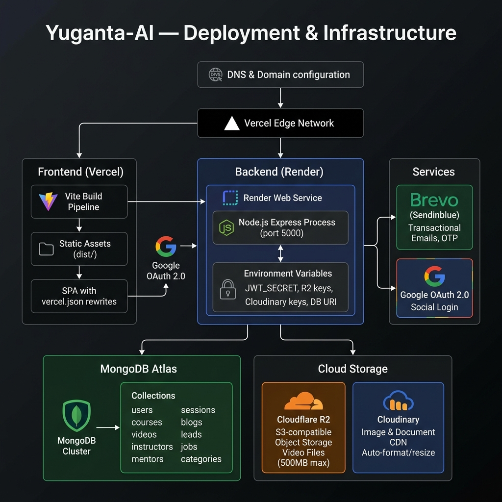

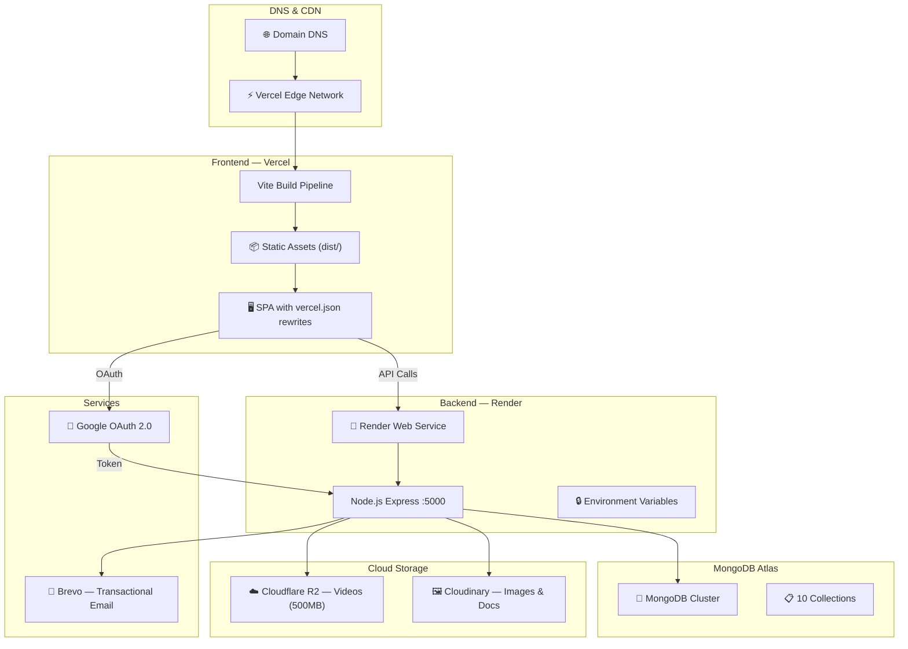
```mermaid
flowchart TB
    subgraph "DNS & CDN"
        DNS["🌐 Domain DNS"]
        VercelEdge["⚡ Vercel Edge Network"]
    end

    subgraph "Frontend — Vercel"
        VercelBuild["Vite Build Pipeline"]
        StaticAssets["📦 Static Assets (dist/)"]
        SPA["🖥️ SPA with vercel.json rewrites"]
    end

    subgraph "Backend — Render"
        RenderService["🚀 Render Web Service"]
        NodeProcess["Node.js Express :5000"]
        EnvVars["🔒 Environment Variables"]
    end

    subgraph "MongoDB Atlas"
        AtlasCluster["🍃 MongoDB Cluster"]
        Collections["📋 10 Collections"]
    end

    subgraph "Cloud Storage"
        R2Storage["☁️ Cloudflare R2 — Videos (500MB)"]
        CloudinaryCDN["🖼️ Cloudinary — Images & Docs"]
    end

    subgraph "Services"
        BrevoAPI["📧 Brevo — Transactional Email"]
        GoogleOAuth["🔑 Google OAuth 2.0"]
    end

    DNS --> VercelEdge --> VercelBuild --> StaticAssets --> SPA
    SPA -->|"API Calls"| RenderService --> NodeProcess
    NodeProcess --> AtlasCluster & R2Storage & CloudinaryCDN & BrevoAPI
    SPA -->|"OAuth"| GoogleOAuth -->|"Token"| NodeProcess
```

---

## 9. Frontend Component Hierarchy

React component tree with 48 pages, 18 components, and 4 context providers.

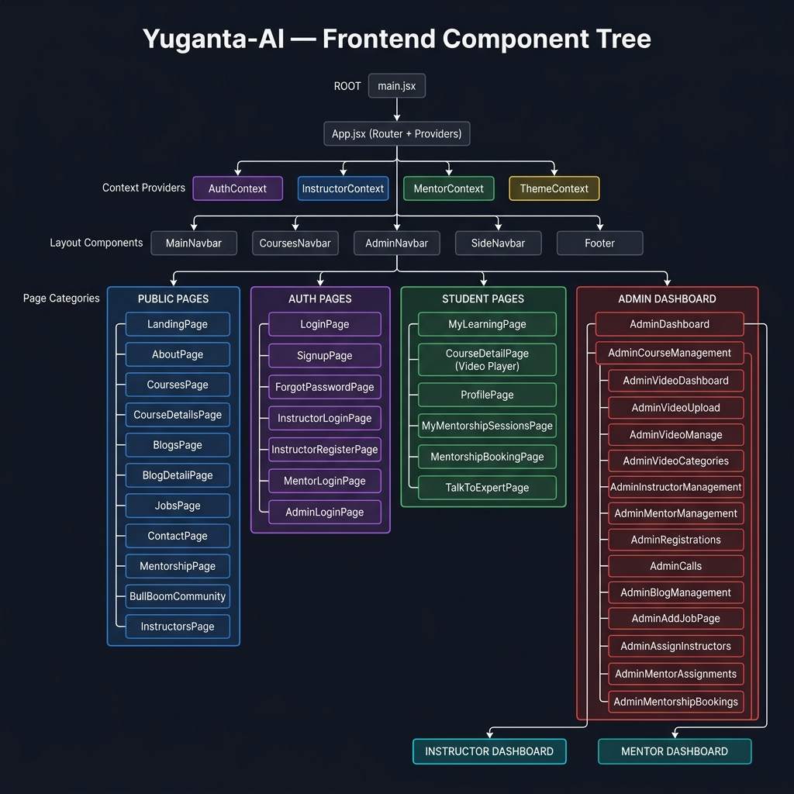

---

## 10. Video Upload & Delivery Pipeline

End-to-end flow from admin upload through Cloudflare R2 to student video playback and progress tracking.

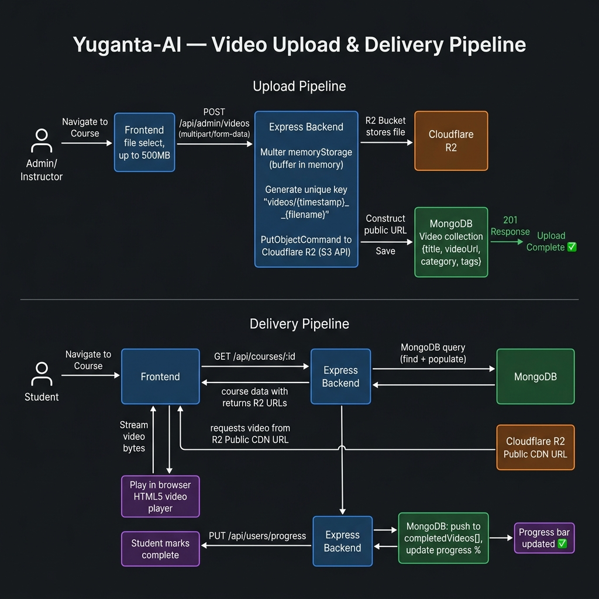

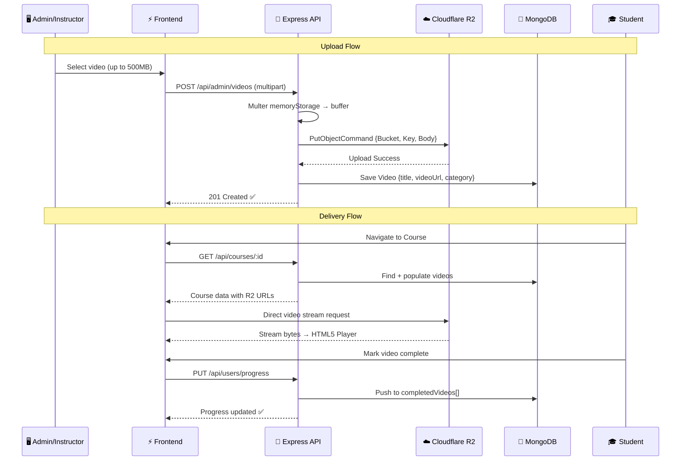
```mermaid
sequenceDiagram
    participant Admin as 🖥️ Admin/Instructor
    participant FE as ⚡ Frontend
    participant BE as 🚀 Express API
    participant R2 as ☁️ Cloudflare R2
    participant DB as 🍃 MongoDB
    participant Student as 🎓 Student

    Note over Admin,Student: Upload Flow
    Admin->>FE: Select video (up to 500MB)
    FE->>BE: POST /api/admin/videos (multipart)
    BE->>BE: Multer memoryStorage → buffer
    BE->>R2: PutObjectCommand {Bucket, Key, Body}
    R2-->>BE: Upload Success
    BE->>DB: Save Video {title, videoUrl, category}
    BE-->>FE: 201 Created ✅

    Note over Admin,Student: Delivery Flow
    Student->>FE: Navigate to Course
    FE->>BE: GET /api/courses/:id
    BE->>DB: Find + populate videos
    BE-->>FE: Course data with R2 URLs
    FE->>R2: Direct video stream request
    R2-->>FE: Stream bytes → HTML5 Player
    
    Student->>FE: Mark video complete
    FE->>BE: PUT /api/users/progress
    BE->>DB: Push to completedVideos[]
    BE-->>FE: Progress updated ✅
```

---

## Summary

| Layer | Technology | Purpose |
|-------|-----------|---------|
| **Frontend** | Vite + React + TailwindCSS | SPA with rich UI, theme support |
| **Backend** | Express.js (Node.js) | REST API server |
| **Database** | MongoDB Atlas (Mongoose) | Document storage, 10 collections |
| **Video Storage** | Cloudflare R2 (S3-compatible) | Large video file hosting (500MB) |
| **Image/Doc Storage** | Cloudinary | Image optimization & CDN |
| **Email** | Brevo (Sendinblue) API | OTP, notifications, transactional |
| **Auth** | JWT + Google OAuth 2.0 | Multi-role authentication |
| **Hosting (FE)** | Vercel | Frontend CDN + Edge |
| **Hosting (BE)** | Render | Backend web service |
| **Containerization** | Docker Compose | Local development & CI |
